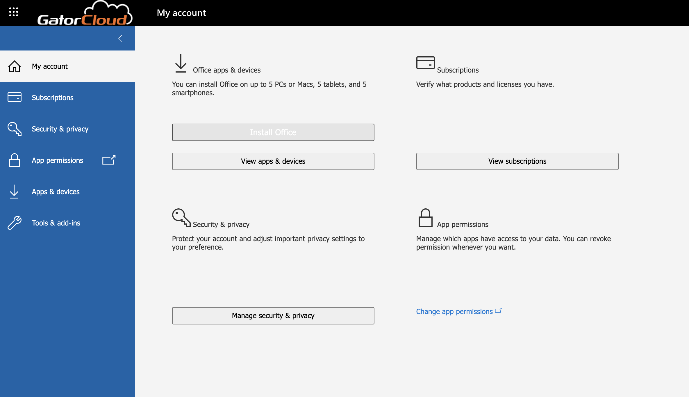

# Welcome to the Excel Workshop!

Please download the Excel file titled "Workshop Datasheet.xlsx". This is the dataset we'll be working on.

# Using Excel

## Downloading from Office 365
* To download Excel from Office 365 go to <a href="https://www.office.com" target="_blank">www.office.com</a> and log in with your UFL email.
* At the top right select "Install and more" and then "Install Microsoft 365 apps".

* This will take you to the "My Account" page where you can click install Office 365.

## Using Online Excel
* If you don't want to download Office 365, there is an online version that can be used.
* To access it, sign in to <a href="https://www.office.com" target="_blank">Office 365</a>, click on the dots in the top right corner, and click on Excel.

* Upload the dataset and start your work!
